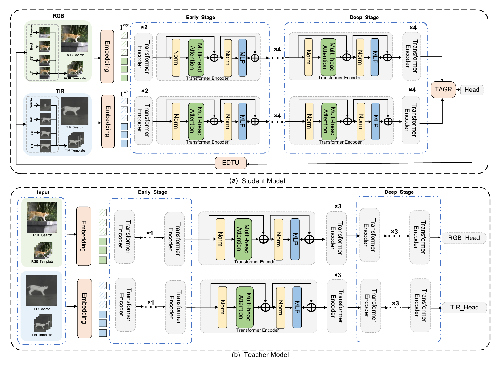

# D3-Track / DFTrack

This repository provides the PyTorch implementation of **Denoising-Driven RGB-T Tracking via Distillation and Dynamic Fusion**. The paper names the method **D3-Track**, while the code, configuration files, and scripts mainly use the name **DFTrack**.

The paper PDF is included at:

```text
Denoising_Driven_RGB_T_Tracking_via_Distillation_and_Dynamic_Fusion__1_ (4).pdf
```

## Method Overview

D3-Track targets RGB-T single object tracking. Its main idea is to reduce unreliable information in multimodal tracking from a denoising perspective:

- **HCKD**: Hierarchical Cross-modal Knowledge-Alignment Distillation. During training, RGB/TIR teacher branches provide cross-modal feature alignment and distillation. During inference, only the student branches are kept, reducing noise propagation from dense cross-modal interactions.
- **TAGR / IRIS**: Token-wise Adaptive Gating & Recalibration. The implementation is in `lib/models/layers/IRIS.py`. It predicts token-wise RGB/TIR fusion weights for search tokens, then applies channel and spatial recalibration.
- **EDTU**: Event-Driven Template Update. The implementation is in `lib/test/tracker/dftrack.py`. It maintains a four-slot template pool, namely LT, ST, Best, and Diverse, to mitigate template staleness and incorrect updates.

The main results reported in the paper include: D3-Track-B256 achieves `78.9/76.2/61.8` on LasHeR, D3-Track-B384 achieves `80.2/77.2/62.9` on LasHeR, D3-Track-B256 achieves `93.6/69.7` on RGBT234, and D3-Track-B256 achieves `91.9/78.3` on VTUAV-ST. Please refer to the paper and the corresponding benchmark protocols for the exact metric definitions.

## Framework

<p align="center">
  
</p>

The framework contains a training-time teacher-student distillation path and an inference-time tracking path. HCKD uses RGB/TIR teachers to supervise the student branches during training. At inference, the student RGB/TIR branches produce features, TAGR/IRIS performs adaptive token-wise fusion, the box head predicts the target state, and EDTU updates the template pool when reliable events are detected.

## Project Structure

```text
DFTrack/
+-- experiments/dftrack/        # Experiment YAML configs
+-- lib/config/dftrack/         # Default configuration
+-- lib/models/dftrack/         # DFTrack network architecture
+-- lib/models/layers/          # Head, attention, IRIS/TAGR, and related modules
+-- lib/train/                  # Training entry points, actors, dataloaders, trainers
+-- lib/test/                   # Tracker and evaluation dataset wrappers
+-- tracking/                   # Training, testing, profiling, and utility scripts
+-- eval_tracker/               # RGBT toolkit evaluation scripts
+-- pretrained/                 # Local pretrained weights, ignored by Git
+-- output/                     # Local checkpoints, logs, and tracking results, ignored by Git
+-- tensorboard/                # Local TensorBoard logs, ignored by Git
```

## Environment Setup

A separate Conda environment is recommended. Install the PyTorch build that matches your CUDA version; the command below is only an example.

```bash
conda create -n dftrack python=3.9 -y
conda activate dftrack

# Choose the PyTorch installation command that matches your CUDA version.
pip install torch torchvision --index-url https://download.pytorch.org/whl/cu121

pip install opencv-python easydict pyyaml timm thop tqdm numpy pandas matplotlib pillow
pip install lmdb jpeg4py visdom wandb gdown numba pycocotools tikzplotlib greenlet

# Required only when using eval_tracker/*.py for official metric evaluation.
pip install rgbt==1.0.1
```

If `jpeg4py` fails to install, you can use OpenCV for image loading first. The current training dataloader passes `opencv_loader` by default.

## Dataset Setup

The default experiment uses the LasHeR training and testing sets. The code expects each sequence to follow this structure:

```text
/path/to/lasher/
+-- trainingset/
|   +-- sequence_name/
|       +-- visible/
|       +-- infrared/
|       +-- init.txt
+-- testingset/
    +-- sequence_name/
        +-- visible/
        +-- infrared/
        +-- init.txt
```

For RGBT234, GTOT, VTUAV, and other datasets, keep a similar `visible/`, `infrared/`, and annotation-file layout, then set the corresponding directories in the local path configuration files.

## Local Path Configuration

Training and testing use separate local path configuration files. Check both files first when moving the project to a new machine.

### Training Paths

Edit `lib/train/admin/local.py`:

```python
self.workspace_dir = "."
self.tensorboard_dir = "./tensorboard/"

self.lasher_dir = "/path/to/lasher/"
self.lasher_trainingset_dir = "/path/to/lasher/trainingset/"
self.lasher_testingset_dir = "/path/to/lasher/testingset/"
self.rgbt234_dir = "/path/to/RGBT234/"
self.gtot_dir = "/path/to/GTOT/"
```

### Testing Paths

Edit `lib/test/evaluation/local.py`:

```python
settings.prj_dir = "./"
settings.save_dir = "./"
settings.results_path = "./output"

settings.lasher_path = "/path/to/lasher/testingset/"
settings.lashertestingset_path = "/path/to/lasher/testingset/"
settings.rgbt234_path = "/path/to/RGBT234/"
settings.gtot_path = "/path/to/GTOT/"
```

Note: `lib/test/evaluation/lasherdataset.py` currently hard-codes `/media/ha/2T/datasets/lasher/testingset/` inside `_get_sequence_list()`. If your LasHeR path is different, either change it to use `self.base_path`, or test with `--dataset_name lashertestingset` and make sure `settings.lasher_path` in `local.py` points to the testing set.

## Pretrained Weights and Configuration

Model weights are intentionally not tracked by Git. Before training or testing, download the required pretrained weights or trained checkpoints separately, then place them under the paths expected by the configuration, or update the YAML/command-line paths to your local files.

The default configuration file is:

```text
experiments/dftrack/dftrack_4b_dropmae_dftrack_tf_cc_mask.25.yaml
```

Key settings include:

- Pretrained weight path: `pretrained/DropTrack_k700_800E_alldata.pth.tar`
- Training set: `LasHeR_trainingSet`
- Validation set: `LasHeR_testingSet`
- Number of template frames: `4`
- Template/search sizes: `128 / 256`
- Training epochs: `30`
- Default testing epoch: `30`

For the default configuration, put the DropTrack pretrained weight at:

```text
pretrained/DropTrack_k700_800E_alldata.pth.tar
```

For testing with a trained DFTrack checkpoint, either put the checkpoint at:

```text
output/checkpoints/train/dftrack/dftrack_4b_dropmae_dftrack_tf_cc_mask.25/OSTrack_DFTrack_ep0030.pth.tar
```

or pass its actual location with `--checkpoint_path`. If no trained checkpoint is available, train the model first with the steps below.

## Training

Using `lib/train/run_training.py` is recommended because its arguments are explicit.

Single-GPU training:

```bash
CUDA_VISIBLE_DEVICES=0 python lib/train/run_training.py \
  --script dftrack \
  --config dftrack_4b_dropmae_dftrack_tf_cc_mask.25 \
  --save_dir ./output \
  --use_lmdb 0 \
  --use_wandb 0
```

Multi-GPU training:

```bash
CUDA_VISIBLE_DEVICES=0,1 python -m torch.distributed.launch \
  --nproc_per_node 2 \
  --master_port 20001 \
  --use-env \
  lib/train/run_training.py \
  --script dftrack \
  --config dftrack_4b_dropmae_dftrack_tf_cc_mask.25 \
  --save_dir ./output \
  --use_lmdb 0 \
  --use_wandb 0
```

Training outputs are saved by default to:

```text
output/checkpoints/train/dftrack/dftrack_4b_dropmae_dftrack_tf_cc_mask.25/
output/logs/
tensorboard/train/dftrack/dftrack_4b_dropmae_dftrack_tf_cc_mask.25/
```

## Testing

The testing entry point is `tracking/test.py`. If `settings.results_path = "./output"` in `lib/test/evaluation/local.py`, tracking results are saved to:

```text
output/dftrack/dftrack_4b_dropmae_dftrack_tf_cc_mask.25_ep030/<dataset_name>/
```

Test on LasHeR with an epoch-30 checkpoint:

```bash
python tracking/test.py dftrack dftrack_4b_dropmae_dftrack_tf_cc_mask.25 \
  --dataset_name lasher \
  --threads 4 \
  --num_gpus 1 \
  --vis_gpus 0 \
  --checkpoint_path output/checkpoints/train/dftrack/dftrack_4b_dropmae_dftrack_tf_cc_mask.25/OSTrack_DFTrack_ep0030.pth.tar
```

If you want to use the configurable-path version of the LasHeR testing set:

```bash
python tracking/test.py dftrack dftrack_4b_dropmae_dftrack_tf_cc_mask.25 \
  --dataset_name lashertestingset \
  --threads 4 \
  --num_gpus 1 \
  --vis_gpus 0 \
  --checkpoint_path output/checkpoints/train/dftrack/dftrack_4b_dropmae_dftrack_tf_cc_mask.25/OSTrack_DFTrack_ep0030.pth.tar
```

Test on RGBT234:

```bash
python tracking/test.py dftrack dftrack_4b_dropmae_dftrack_tf_cc_mask.25 \
  --dataset_name rgbt234 \
  --threads 4 \
  --num_gpus 1 \
  --vis_gpus 0 \
  --checkpoint_path output/checkpoints/train/dftrack/dftrack_4b_dropmae_dftrack_tf_cc_mask.25/OSTrack_DFTrack_ep0030.pth.tar
```

`--threads` controls the number of sequences tested in parallel, `--num_gpus` controls GPU allocation during parallel testing, and `--vis_gpus` sets the visible GPU IDs.

## LasHeR Metric Evaluation

`eval_tracker/lasher.py` evaluates generated tracking results with the `rgbt` toolkit. The current script hard-codes `result_path`, so change it to your result directory before running, for example:

```python
result_path = "/media/ha/2T/kwx/DFTrack/output/dftrack/dftrack_4b_dropmae_dftrack_tf_cc_mask.25_ep030/lasher"
```

Then run:

```bash
python eval_tracker/lasher.py
```

The script uses `where_seq_already()` in `eval_tracker/seqList.py` to find completed sequences. This function depends on each sequence having a corresponding `*_time.txt` file, so the result directory should contain:

```text
sequence_name.txt
sequence_name_time.txt
```

If the testing result directory is `lashertestingset`, set `result_path` to that directory instead:

```text
output/dftrack/dftrack_4b_dropmae_dftrack_tf_cc_mask.25_ep030/lashertestingset
```

## Speed Profiling

Use `tracking/profile_model.py` to profile DFTrack inference speed:

```bash
python tracking/profile_model.py \
  --script dftrack \
  --config dftrack_4b_dropmae_dftrack_tf_cc_mask.25 \
  --warmup 50 \
  --timing 200
```

The DFTrack branch in this script reports FPS only. It does not report FLOPs or parameter count.

## FAQ

### 1. Dataset paths cannot be found

Check these files first:

- `lib/train/admin/local.py`
- `lib/test/evaluation/local.py`
- Whether `lib/test/evaluation/lasherdataset.py` still contains a hard-coded LasHeR path

### 2. No sequences are evaluated after testing

`eval_tracker/seqList.py` only counts sequences with `_time.txt` files. If the result directory only has `sequence_name.txt`, `seq num` will be 0.

### 3. Default checkpoint path

If `--checkpoint_path` is not provided during testing, the code loads weights from:

```text
./output/checkpoints/train/dftrack/<config>/OSTrack_DFTrack_ep0030.pth.tar
```

The `0030` part comes from `TEST.EPOCH` in the YAML file.

### 4. CUDA out of memory

Reduce `TRAIN.BATCH_SIZE` in the YAML file or reduce `--threads` during parallel testing. The current default configuration uses `BATCH_SIZE: 4`; the paper training setting is 30 epochs with 60000 training pairs per epoch.

## Citation

If you use this project, please cite the original paper:

```text
Denoising-Driven RGB-T Tracking via Distillation and Dynamic Fusion
Fangmei Chen, Weixin Kong, Lifeng Wang, Fasheng Wang, Fuming Sun, Haojie Li
```

Please use the official BibTeX from the final published version when it is available.
